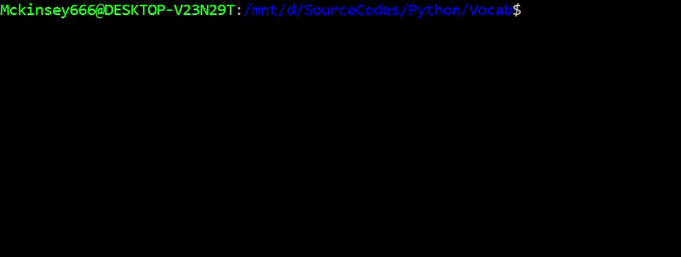
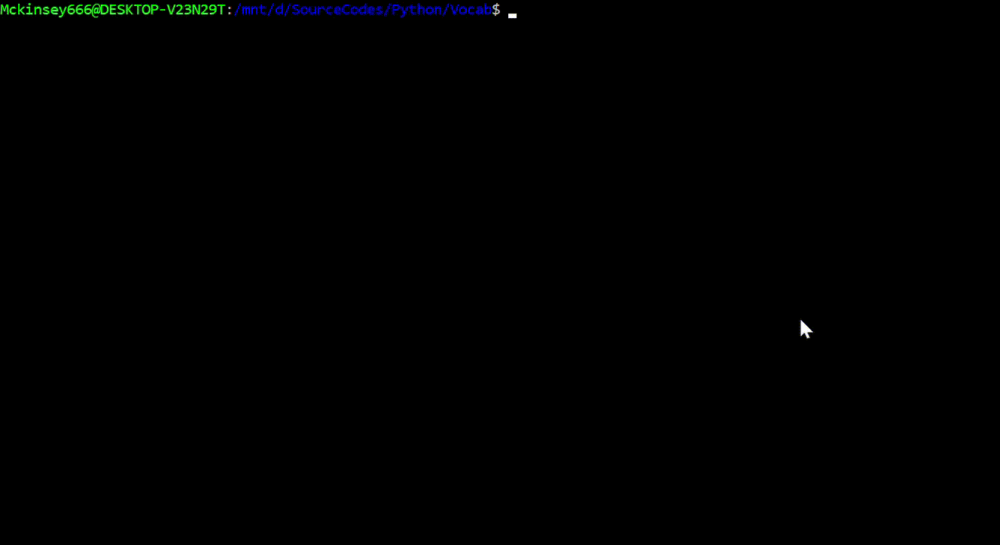
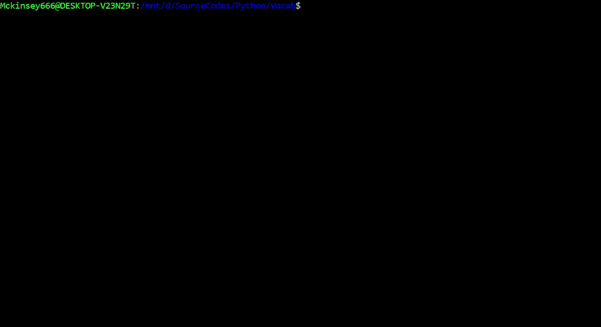
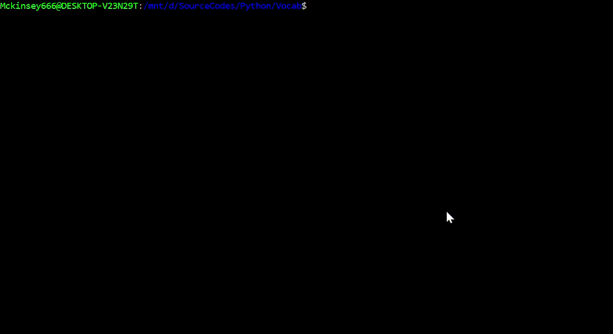
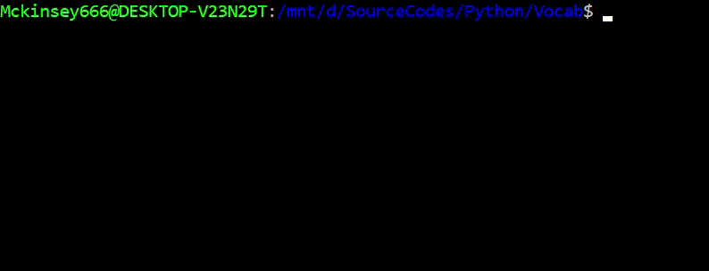

# Vocab
<p align=center>

<br>
<a target="_blank" href="https://www.python.org/downloads/" title="Python version"></a>
<a target="_blank" href="https://opensource.org/licenses/MIT" title="License: MIT"></a>
<a target="_blank" href="http://makeapullrequest.com" title="PRs Welcome"></a>
</p>

***
> A lightweight online dictionary integration to the command line. No browsers. No paperbooks.
***

<p align=center></p>

## Features
- Directly query words from the command line.
- Save words to your local dictionary.
- Add notes to saved words.
- Interactive word game to hone your vocabulary skills.
## Requirements
<a target="_blank" href="https://www.python.org/downloads/" title="Python version"></a> and the following libraries are required.
- beautifulsoup4
- pyfiglet
- termcolor
- requests
- (Linux compatible) tty, termios

## Run
- Clone the git repository `./Vocab`.
- In `./Vocab` directory, type `./vocab`.
- Enjoy the experience!

## Usage
### Query Mode
> Directly search and save unknown words **from the command line**.
```
$ ./vocab -m query
```


### Dictionary Mode
> Scroll though pages to search for saved words.
```
$ ./vocab -m dict
```


### Edit mode
> Edit your save words and add notes.
```
$ ./vocab -m edit
```


### Interactive Mode
> Test your vocabulary skills with the interactive mode.
```
$ ./vocab -m interactive
```


### Load Word List
> Load a list of words from to your local dictionary.
```
$ ./vocab -f <path to file>
```


### Count Total Words
> Count number of words saved in your local dictionary.
```
$ ./vocab -c
```


### Reset Local Dictionary
```
$ ./vocab -r
```
### Help
```
$ ./vocab -h
```

## Todo
- Synonyms / Antonyms.
- Full command line support (left, right keys, autofill).
- Search history (up, down keys).