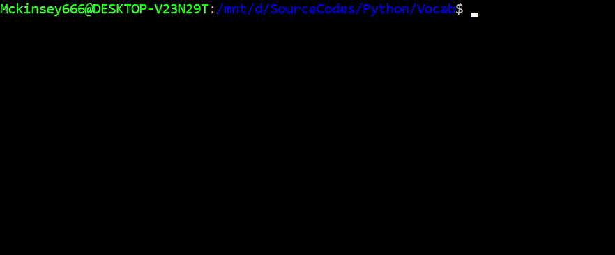

# 📚 Vocab
<p align=center>

<br>
<a target="_blank"></a>
<a target="_blank" href="https://www.python.org/downloads/" title="Python version"></a>
<a target="_blank" href="https://opensource.org/licenses/MIT" title="License: MIT"></a>
<a target="_blank" href="http://makeapullrequest.com" title="PRs Welcome"></a>
</p>

***
> 📚 A lightweight online dictionary integration to the command line. No browsers. No paperbacks.
***

<p align=center></p>

## Features
> ❓ Directly query words from the command line.

> 📓 Save words to your local dictionary.

> 📝 Add notes to saved words.

> 🎮 Interactive word game to hone your vocabulary skills.

## So how is this different from `dict` ?
`dict` is the client for DICT, or the Dictionary Server Protocol on Unix-like platforms. It is used to query natural language dictionaries without firing up a bloaty brower, which tremendously slows down your workflow.

`Vocab` aims to do the same as `dict`, only with some differneces:

- Less verbose result (since `Vocab` only uses one source).
- Can save words to local client dictionary pickle file.
- Can add notes to a saved word.
- Includes a interactive word-quiz feature.

All in all, `Vocab` is a great tool for fast word queries with easy-to-read definitions, and a good support for ESL users.

## Requirements
<a target="_blank" href="https://www.python.org/downloads/" title="Python version"></a> and the following libraries are required.

> <a target="_blank">

> <a target="_blank"></a> <a target="_blank"></a>

## Setting up
- Clone the git repository `Vocab`.
- In `/Vocab/lib/config.py`, modify `DICT_PATH` to the ABSOLUTE PATH of the local dictionary file on your computer.
- In root, type `vi ~/.bashrc`. Append the following at the end of the bashrc file : `export PATH=$PATH/<ABSOLUTE PATH to git repo>`

## Running
🔥 Launch `vocab` anywhere on your terminal.


## Usage
### Query Mode
> ❓ Directly search and save unknown words **from the command line**.
```
$ vocab -m query
```


### Dictionary Mode
> 📓 Scroll though pages to search for saved words.
```
$ vocab -m dict
```


### Edit mode
> ✏️ Edit your save words and add notes.
```
$ vocab -m edit
```


### Interactive Mode
> 🎮 Test your vocabulary skills with the interactive mode.
```
$ vocab -m interactive
```


### Load Word List
> 📜 Load a list of words from to your local dictionary.
```
$ vocab -f <ABSOLUTE path to file>
```


### Count Total Words
> 🔢 Count number of words saved in your local dictionary.
```
$ vocab -c
```


### Reset Local Dictionary
```
$ vocab -r
```
### Help
```
$ vocab -h
```

## Todo
- Synonyms / Antonyms.
- Full command line support (left, right keys, autofill).
- Search history (up, down keys).
